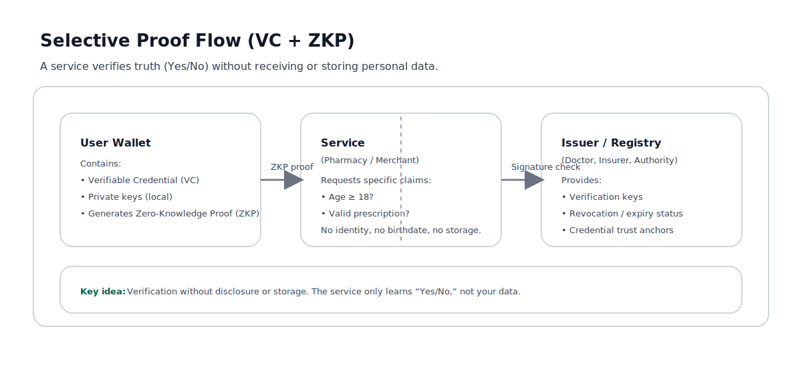

# Human Context Protocol (Draft)

## Why this exists

Digital systems today collect far more data than they need.
This creates anxiety, confusion, security risk, and a growing lack of trust.

Most interactions are temporary, but the data they generate is permanent.

This repository explores a simple question:

**What if digital systems asked only for proof — not data — and forgot everything once the task was done?**

## Visual overview

A high-level view of how verifiable credentials and zero-knowledge proofs enable trust without exposing personal data.

## The core idea

Instead of usernames, passwords, cookies, and permanent records, systems could rely on:

- Verifiable Credentials (VCs)
- Selective disclosure
- Zero-Knowledge Proofs (ZKP)
- Purpose-bound, temporary data

In this model:
- Identity is asserted, not exposed
- Data is loaned, not owned
- Trust is proven, not assumed
- Storage is the exception, not the default

---

## A simple example: pharmacy verification

Imagine picking up a prescription.

The pharmacy system does **not** ask:
- Who are you?
- What is your birthdate?
- What is your insurance number?

Instead, it asks only:
- Are you over 18?
- Do you have a valid prescription?
- Is there active coverage?

Your digital wallet responds with cryptographic proofs.
No personal data is shared.
The pharmacy sees only “Yes / No”.
The interaction completes.
The data disappears.

---

## What this is

- A reference model
- A thought experiment grounded in real cryptography
- A human-centered approach to digital trust
- A public draft meant to evolve

---

## What this is not

- Not a product
- Not a startup
- Not anti-business
- Not anti-AI
- Not a finished protocol

---

## Extended context

Most modern digital systems were designed around convenience and scale.
As a result, they quietly evolved into systems of accumulation:
more data, longer retention, deeper profiling.

This accumulation is rarely intentional.
It is often the byproduct of tools that optimize for growth rather than trust.

The Human Context Protocol explores a different assumption:

> Not all data needs to be stored to be useful.

In many real-world interactions, trust can be established through proof,
not disclosure, and through verification, not surveillance.

By combining verifiable credentials, selective disclosure, and
zero-knowledge proofs, it becomes possible to design systems where:

- users remain in control of their identity
- organizations reduce liability and breach risk
- data exists only for the duration of its purpose
- trust is established mathematically, not socially

This repository does not propose a universal replacement for the web.
Instead, it documents principles and examples that can be applied
incrementally — in healthcare, travel, finance, and everyday services.

---

## Status

Draft 0.1  
Open to discussion, critique, and refinement.
